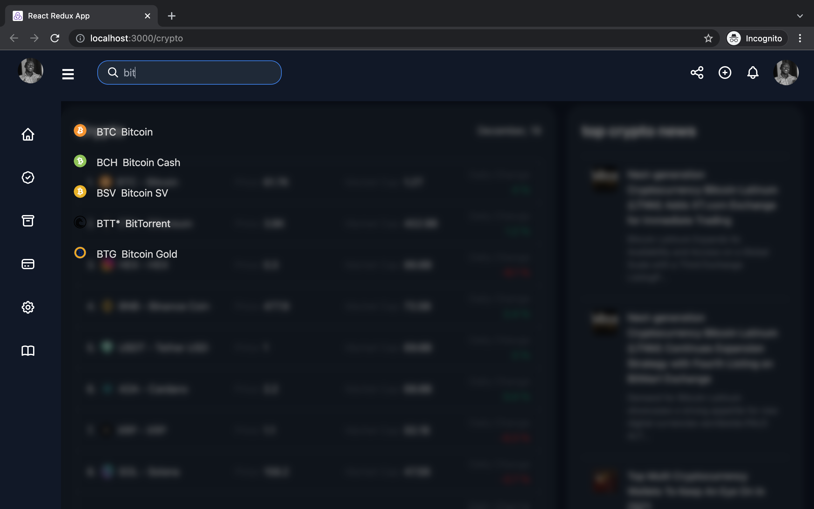
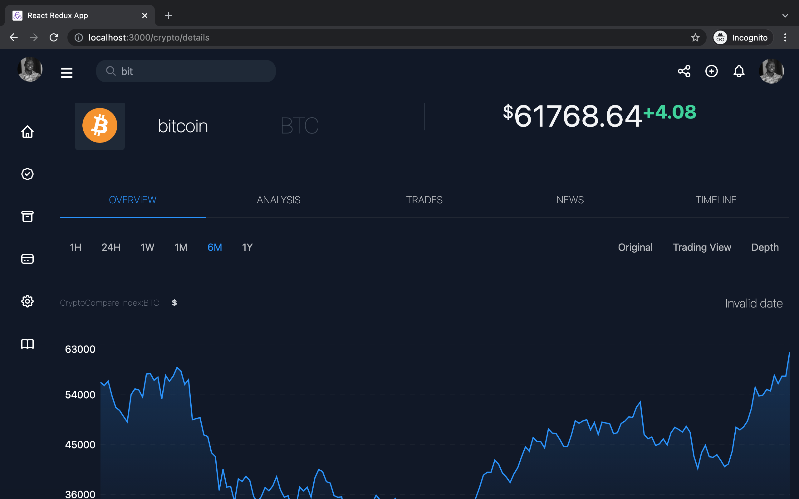
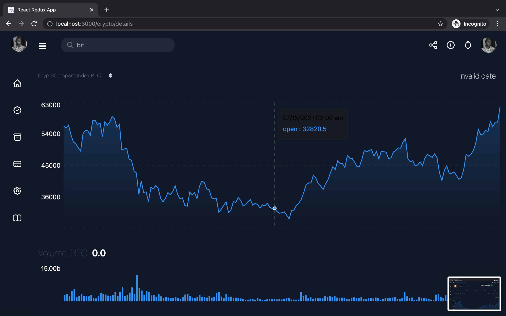

# React crypto

react-crypto is a simple Cryptocurrency dashboard build with React, Typescript, Websockets powered by RapidAPI and CryptoCompare API

# Installation Instructions

Clone the repository, change directories, and use NPM to install the dependencies.

```bash
$ git clone https://github.com/rogerndutiye/react-crypto.git
$ cd react-crypto
$ npm install
```

## Usage

- start development server with `npm start` or `sudo npm start`

* `npm start`

now The project can be viewed in the browser at

- [http://localhost:3000](http://localhost:3000)

The page will reload if you make edits.\
You will also see any lint errors in the console.

## Screenshots







